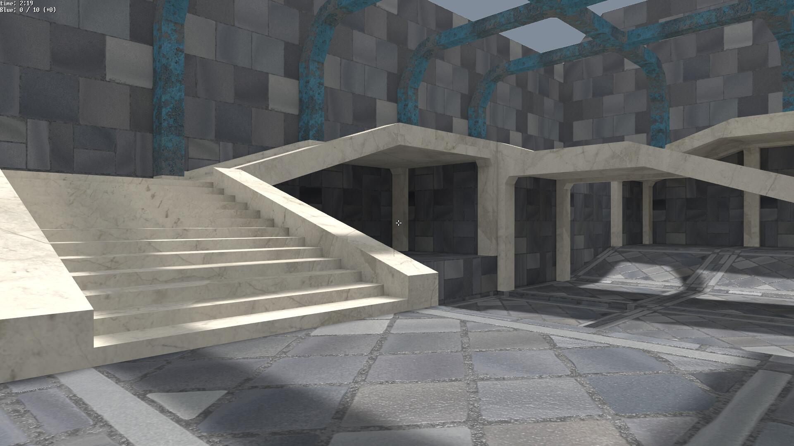
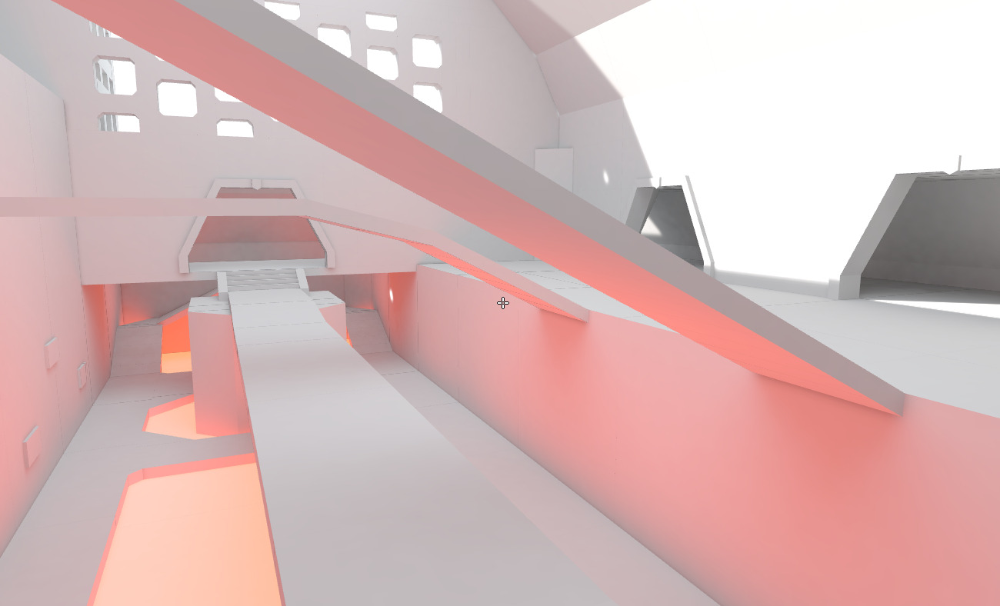
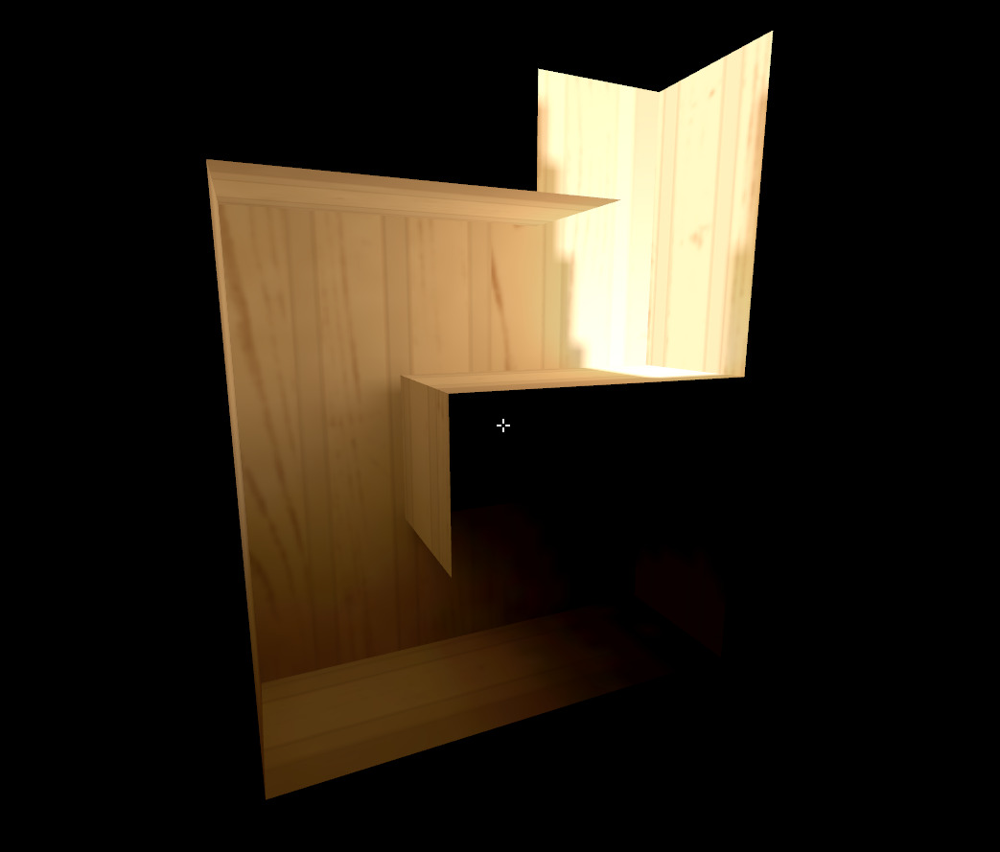
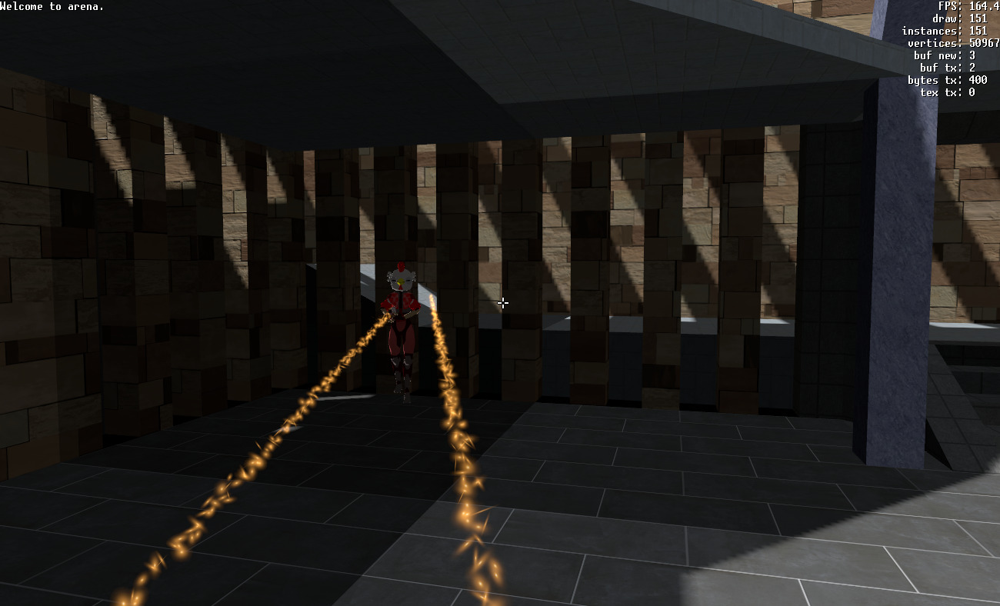
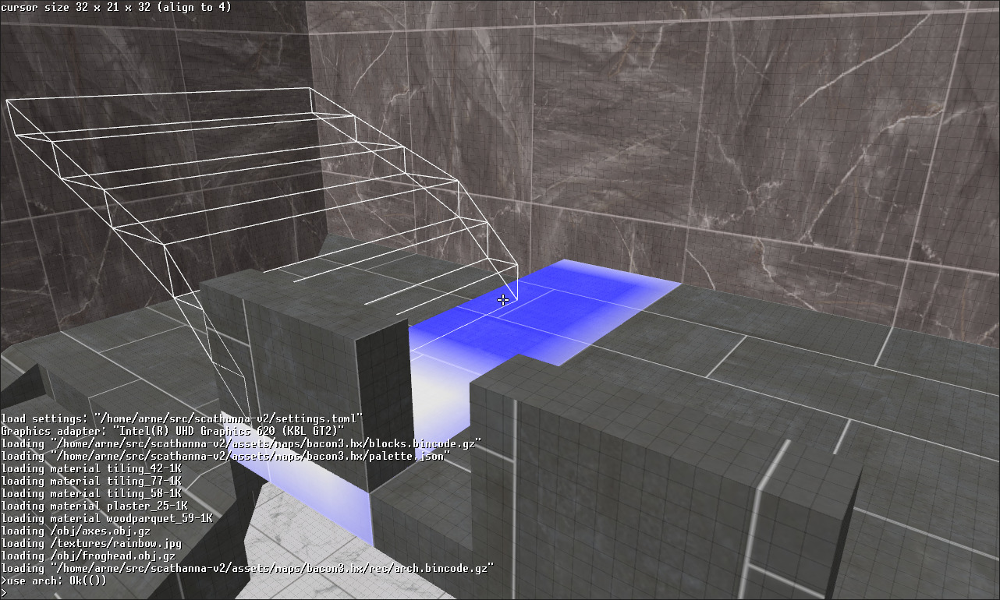
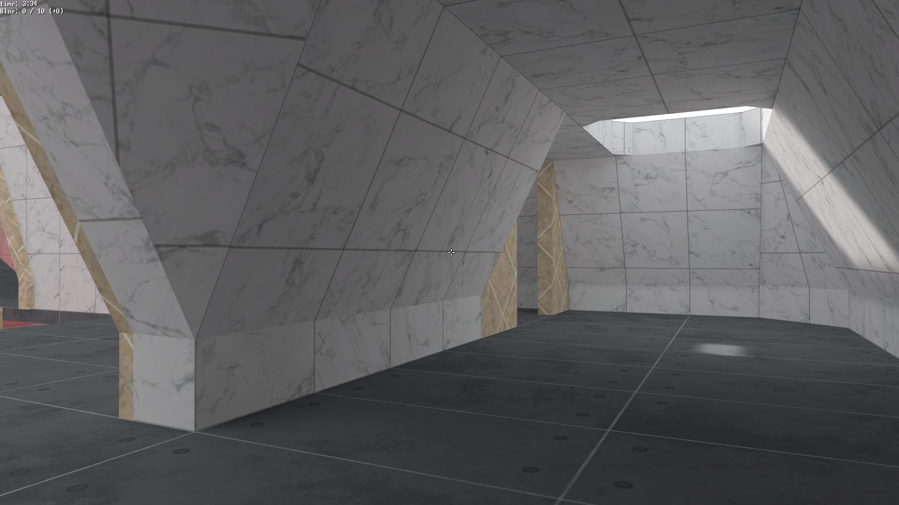
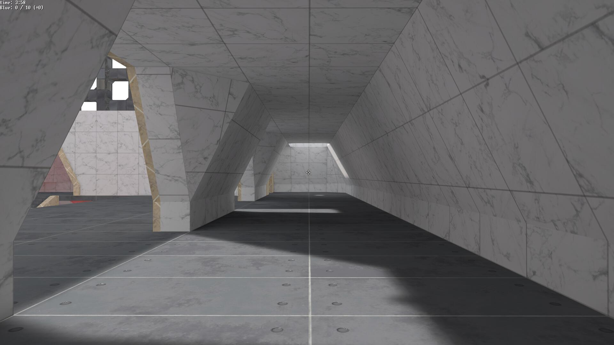
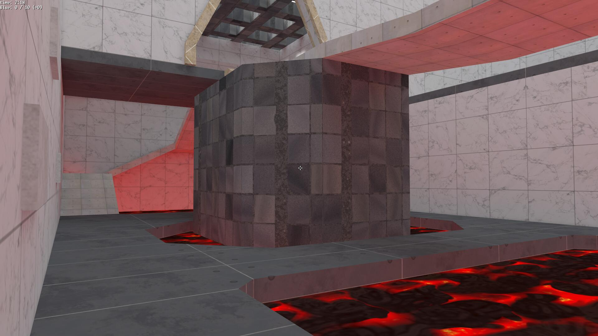
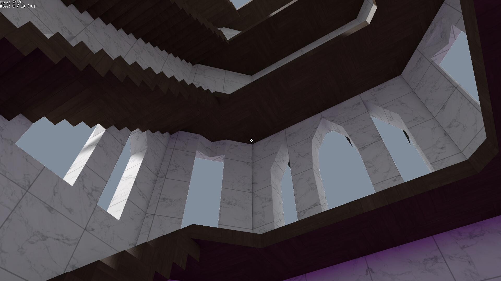

# Scathanna 2

A multiplayer first person shooter written from scratch in [Rust](https://www.rust-lang.org) (not using any existing engine/render) and [WGPU](https://wgpu.rs). Successor of my voxel game [Scathanna](github.com/barnex/scathanna-3d).



## Features

### Lighting

I wrote this game as an excuse to implement physics-based global illumination based on a hand-written ray tracer. 

It uses statistical methods like [Stratified sampling](https://en.wikipedia.org/wiki/Stratified_sampling) and [Low-discrepancy sequences](https://en.wikipedia.org/wiki/Halton_sequence) to bake noise-free lightmaps just a few minutes.

Example of a baked lightmap (all textures have been removed to show only the lighting):



Indirect light can bounce many times and travel  deep into otherwise unlit areas. E.g., this tunnel is illuminated from the top only, yet the light travels deep and falls off very naturally. 




### Networked multiplayer

Multiplayer deathmatch and team match games can be played over the network.



### Built-in editor

The map editor works by letting the user place a number of "blocks" with pre-defined shapes, inspired by LEGO blocks.
This allows for relatively complex structures to be built reasonably intuitively. 



## Installation

Make sure you have Rust installed from [rustup.rs](http://rustup.rs).

Install dependencies:

```
sudo apt install \
	libfontconfig-dev
	cmake
	libasound2-dev
```

Then

```
git clone https://github.com/barnex/scathanna-v2.git
cd scathanna-v2

cargo run --release --bin server &
cargo run --release --bin play

```

## Gallery







